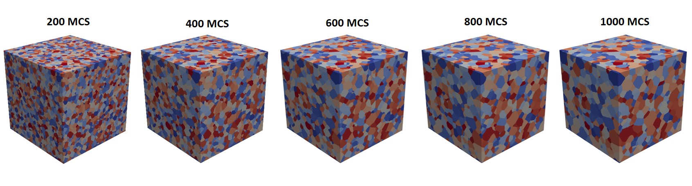

# GrainGrowthMC

Three-dimensional Monte Carlo simulation for grain growth in Julia.

## Description

- Three-dimensional grid of orientation states
- 3D Moore neighborhood and periodic boundary conditions
- Potts model for orientation update
- Breadth-first search (BFS) algorithm for unique grain label assignment
- Export .vti files for visualization and .h5 files for data storage

## Quick start

- Clone the repository: `git clone https://github.com/shawnlu6/GrainGrowthMC.git`
- Navigate to the project directory: `cd GrainGrowthMC/src`
- Activate the project environment: `
julia --project=.. run_mc.jl`
- Visualize the results in "output" directory use ParaView.

## Simulation parameters
- `params.jl`: contains the simulation parameters

## Example

- Simulation parameters:
    - Grid size: 300 x 300 x 300
    - Number of orientation states: 128
    - System temperature: 0.7
    - Number of Monte Carlo steps: 1000
    - Save steps: 200
    

